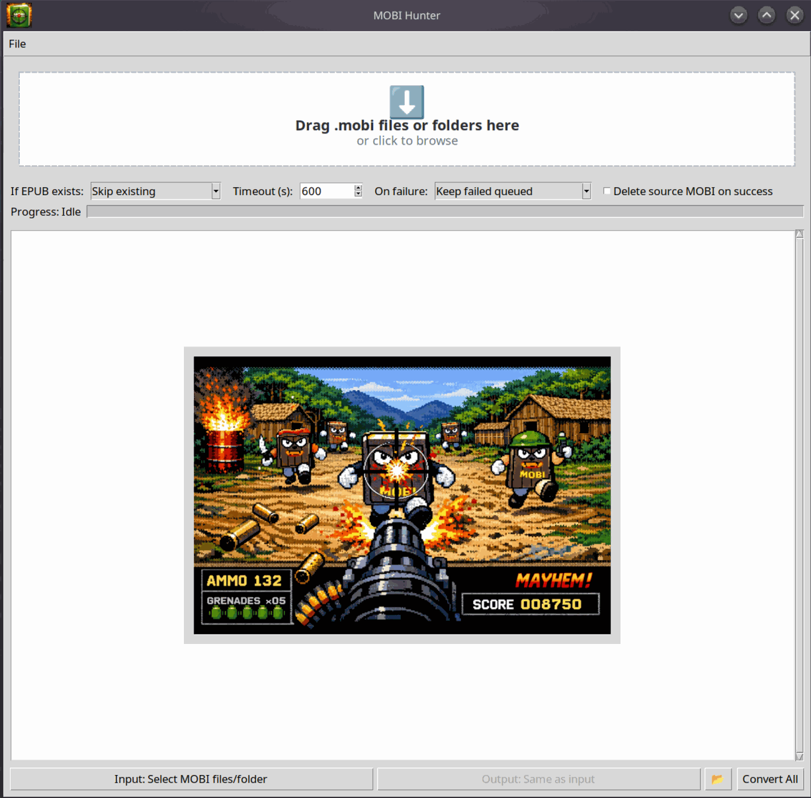

<p align="center">
  
</p>

<h1 align="center">MOBIHunter</h1>

<p align="center">
  
  
  
</p>
<p align="center">
  Fast, drag-and-drop MOBI → EPUB conversion powered by Calibre
</p>

<p align="center">
  
</p>

<p align="center">
  Simple. Fast. No nonsense.
</p>


# MOBI Hunter


MOBI Hunter is a desktop GUI tool for converting `.mobi` ebooks to `.epub` using Calibre's `ebook-convert`.

## Features

- Drag-and-drop files and folders
- Large in-app file/folder picker with session directory memory
- Duplicate detection
- Batch conversion with progress tracking
- Existing output policy: skip / overwrite / rename
- Split-safe retry for common Calibre split errors
- Cancel active conversion
- Optional delete-source-on-success toggle
- Output folder shortcut
- About dialog with dependency status checks
- 


## Requirements


- Python 3.10+
- Calibre installed (`ebook-convert` available on `PATH`)
- Python package: `tkinterdnd2`
- Python package: `Pillow` (used for high-quality icon resizing)

## Install (Linux/macOS)

```bash
python3 -m venv .venv
source .venv/bin/activate
pip install -r requirements.txt
```

## Install (Windows PowerShell)

```powershell
py -m venv .venv
.\.venv\Scripts\Activate.ps1
pip install -r requirements.txt
```

## Calibre / ebook-convert

If `ebook-convert` is missing, install Calibre:

- https://calibre-ebook.com/download

After install, restart terminal and app so `ebook-convert` is on `PATH`.

## Run (Linux/macOS)

```bash
source .venv/bin/activate
python main.py
```

## Run (Windows PowerShell)

```powershell
.\.venv\Scripts\Activate.ps1
python main.py
```

## Usage

1. Add MOBI files/folders via drag-drop or `Add MOBI...`.
2. Choose output behavior if EPUB already exists.
3. Optionally set timeout and source deletion behavior.
4. Click `Convert All`.
5. Review logs and copy errors if needed.
6. Open `About` to see live dependency status.

## Troubleshooting

- `ebook-convert not found`:
  Install Calibre and restart the app.
- Conversion split errors:
  App auto-retries with safer split settings.
- Drag-and-drop unavailable:
  Ensure `tkinterdnd2` is installed in the active environment.
- About button is red:
  One or more required dependencies are missing; open About for install hints.

## License

MIT. See [LICENSE](LICENSE).
