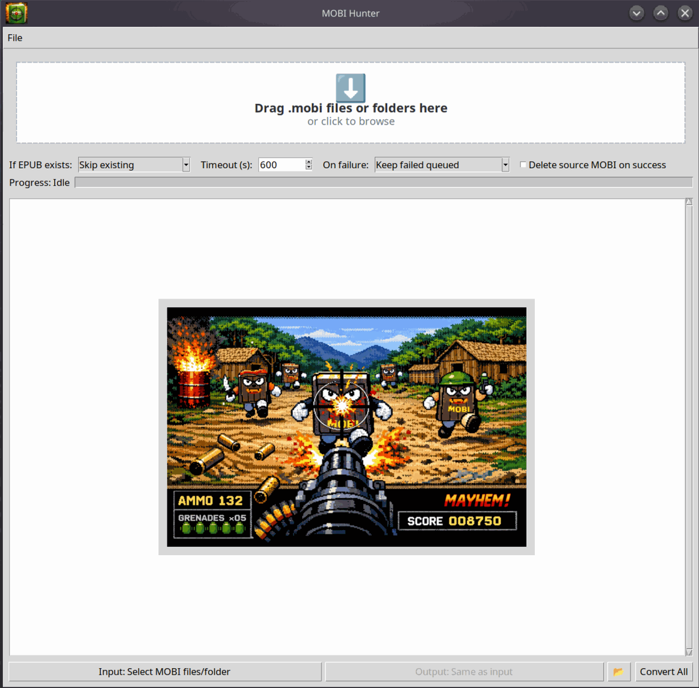

<p align="center">
  
</p>

<h1 align="center">MOBIHunter</h1>

<p align="center">
  
  
  
</p>

<p align="center">
  Fast, drag-and-drop MOBI → EPUB conversion powered by Calibre
</p>

<p align="center">
  
</p>

## Features

- Drag-and-drop files and folders
- File menu actions for Add MOBI, Clear List, Copy Errors, and About
- Large in-app file/folder picker with session directory memory
- Duplicate detection
- Batch conversion with progress tracking
- Existing output policy: skip / overwrite / rename
- Split-safe retry for common Calibre split errors
- Optional separate output folder toggle
- Bottom status bar (dependency status, current file, conversion result)
- Splash screen branding and About dialog dependency checks

## Requirements

- Python 3.10+
- Calibre installed (`ebook-convert` available on `PATH`)
- Python package: `tkinterdnd2`
- Python package: `Pillow`

## Install (Linux/macOS)

```bash
python3 -m venv .venv
source .venv/bin/activate
pip install -r requirements.txt
```

## Install (Windows PowerShell)

```powershell
py -m venv .venv
.\.venv\Scripts\Activate.ps1
pip install -r requirements.txt
```

## Run (Linux/macOS)

```bash
source .venv/bin/activate
python main.py
```

## Run (Windows PowerShell)

```powershell
.\.venv\Scripts\Activate.ps1
python main.py
```

## Linux Portable Build (GitHub Releases)

### End user: download and run

```bash
wget https://github.com/shammyfiveducks/MOBIHunter/releases/latest/download/MOBIHunter-linux-portable.tar.gz
tar -xzf MOBIHunter-linux-portable.tar.gz
cd MOBIHunter
chmod +x MOBIHunter
./MOBIHunter
```

Calibre (`ebook-convert`) still needs to be installed on the Linux machine.

### Maintainer: build and upload tarball

```bash
python3 -m venv .venv
source .venv/bin/activate
pip install -r requirements.txt
pip install pyinstaller

python -m PyInstaller \
  --noconfirm \
  --windowed \
  --name MOBIHunter \
  --add-data "assets:assets" \
  --collect-all tkinterdnd2 \
  main.py

tar -czf MOBIHunter-linux-portable.tar.gz -C dist MOBIHunter
```

Upload `MOBIHunter-linux-portable.tar.gz` at:
https://github.com/shammyfiveducks/MOBIHunter/releases/new

## Usage

1. Add MOBI files/folders using drag-and-drop or `File -> Add MOBI...`.
2. Optionally set output behavior and timeout.
3. Optionally set a separate output folder:
   - Use the bottom `Output` button, or
   - Toggle `File -> Use Separate Output Folder`.
4. Click `Convert All` (bottom-right).
5. Watch progress and bottom status bar updates.
6. If needed, copy conversion details from `File -> Copy Errors`.

## Troubleshooting

- `ebook-convert not found`:
  Install Calibre and restart the app.
- Drag-and-drop unavailable:
  Ensure `tkinterdnd2` is installed in the active environment.
- App does not appear to launch from downloaded Linux package:
  Start from terminal with `./MOBIHunter` to see behavior in-session.
- Dependencies missing:
  Check the bottom status bar and open `File -> About` for details.

## Acknowledgements

- MOBI to EPUB conversion is performed by **Calibre** via `ebook-convert`.
  - Project: https://calibre-ebook.com/
  - Source: https://github.com/kovidgoyal/calibre
- Drag-and-drop support is provided by **tkinterdnd2**.
- Image loading/scaling support uses **Pillow**.

## License

MIT. See [LICENSE](LICENSE).

If you find this useful, please consider starring the repo.
